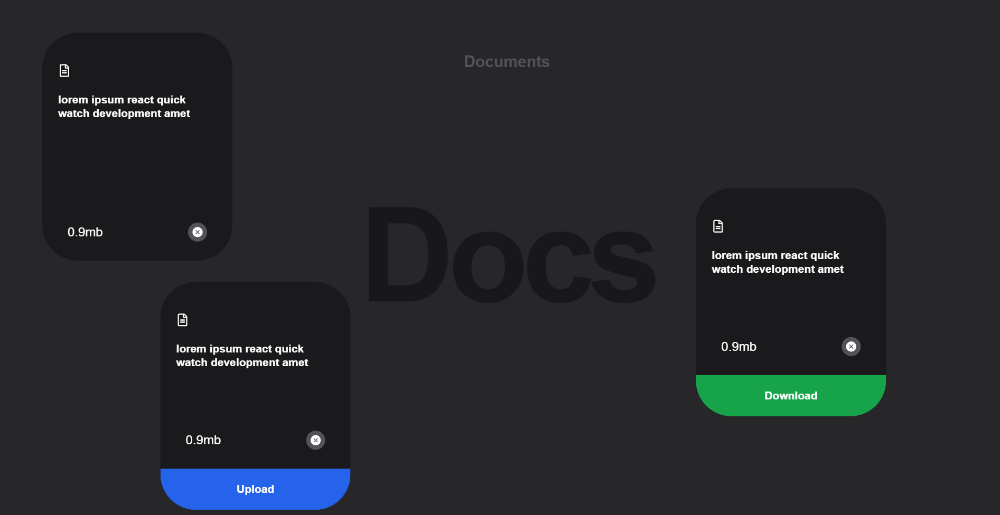

# Draggable Docs Cards UI

Interactive **React** UI with **draggable document cards**, dynamic tags, and a styled background.

---

## Tech Stack

**React** | **Tailwind CSS** | **Framer Motion** | **React Icons** | **Vite**

---

## Features

- **Draggable cards** using Framer Motion  
- **Dynamic tags** (Download / Upload)  
- **Responsive design** with Tailwind CSS  
- **Icons** using React Icons  

---

## Usage

- Drag the **cards** to interact  
- Tags appear based on card data  
- Icons simulate **download** or **close** actions  

